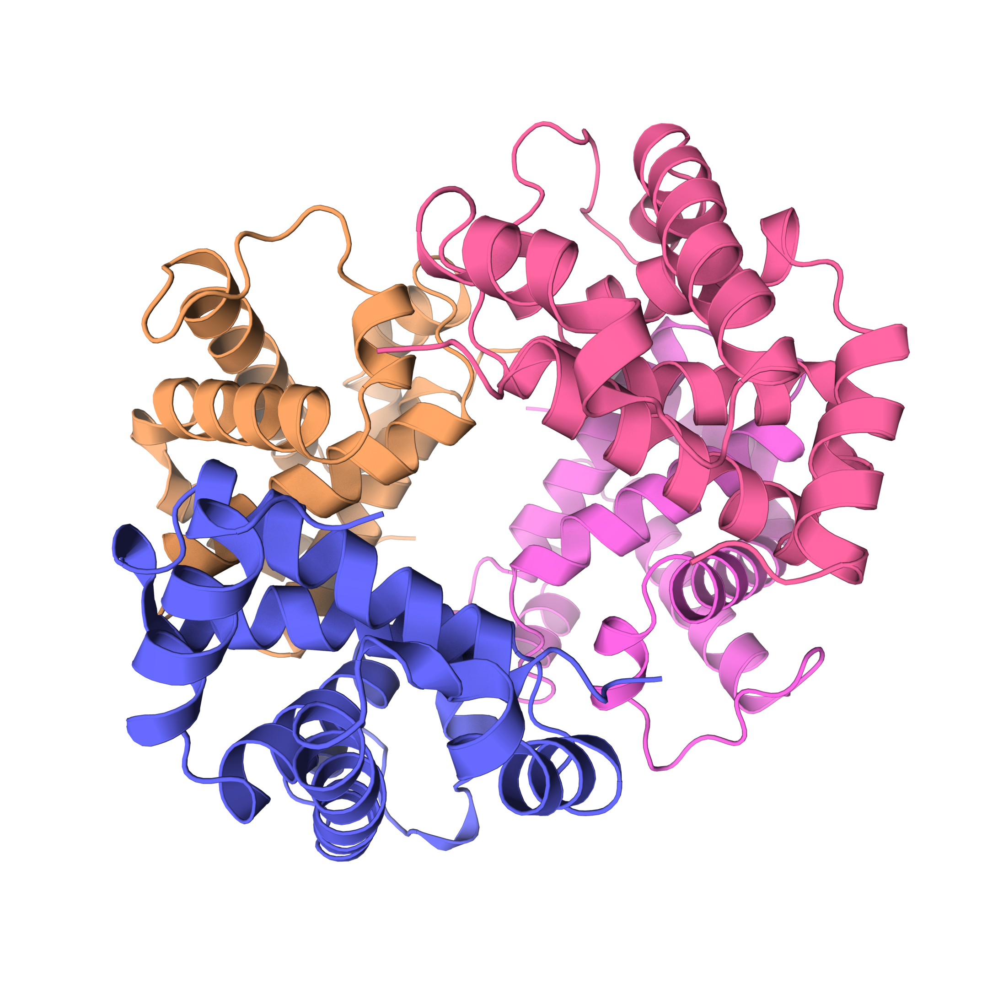

# Домашнее задание 4

ПО: [Protein Imager](http://3dproteinimaging.com/protein-imager/)

Инструкция к ПО: [overview](https://3dproteinimaging.com/info/interface/overview.pdf?v=2.12)

Белок: [1A3N](https://www.rcsb.org/structure/1A3N)

## Визуализация белка
Визуализация выбирается на правой боковой панели

### Wireframe
В Protein Imager называется **Stick**

### Backbone
В Protein Imager называется **Tube**

### Spacefill
В Protein Imager называется **Sphere**

### Ribbons
В Protein Imager называется **Cartoon**

### Molecular surface
В Protein Imager называется **Surface**

## Раскраска структуры
### Цветовая модель CPK
Выбрана цветовая схема, которая красит атомы как в схеме CPK

### Различные цвета по доменам (частям) белка
Различные цвета по цепям (A, B, C, D)

## Изображение белка публикационного качества
Выставленные настройки:

