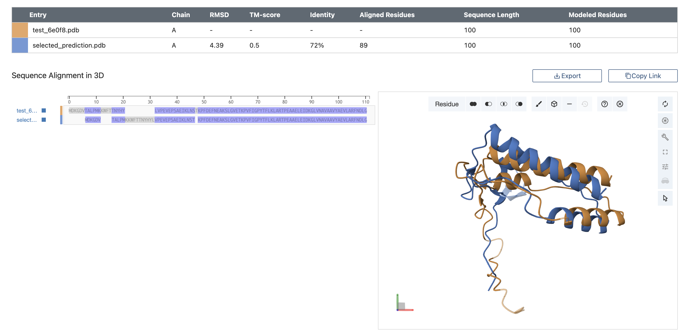
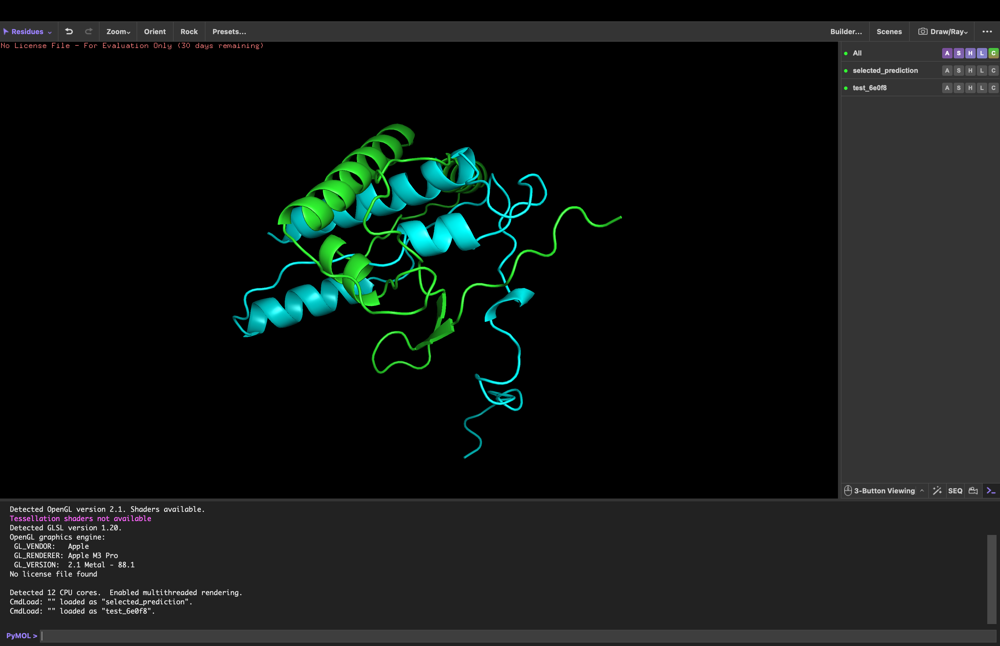

# Домашнее задание 5

## 1
Последовательность:
`MDKGDVTALPMKKWFTTNYHYLVPEVEPSAEIKLNSTKPFDEFNEAKSLGVETKPVFIGPYTFLKLARTPEAAELEIDKGLVNAVAAVYAEVLARFNDLG`

Программы-предсказатели:
- OpenFold
- OmegaFold 

Программа-выравниватель: https://www.rcsb.org/alignment (Alignment Method: jCE)

## 2
Ноутбуки:
- [OpenFold](notebooks/OpenFold.ipynb)
- [OmegaFold](notebooks/omegafold.ipynb)

## 3
Полученные предсказания структур:
- [Предсказание с OmegaFold](predictions/test_6e0f8.pdb)
- [Предсказание с OpenFold](predictions/selected_prediction.pdb)

## 4
Программа выравнивания

- [Результат выравнивания](alignment/sequence_alignment_2025-11-2-23-4-7.fasta)
- [Сопутствующие файлы](alignment)

## 5, 6
PyMOL

[PyMOL-сессия](pyMOL/pyMOL_session.pse)

## 7
Полученные предсказания сходны на 72% (identity = 72%) — основные структурные элементы совпадают, различия наблюдаются преимущественно в начале цепи и отдельных участках.
Это может быть обусловлено особенностями используемых алгоритмов.